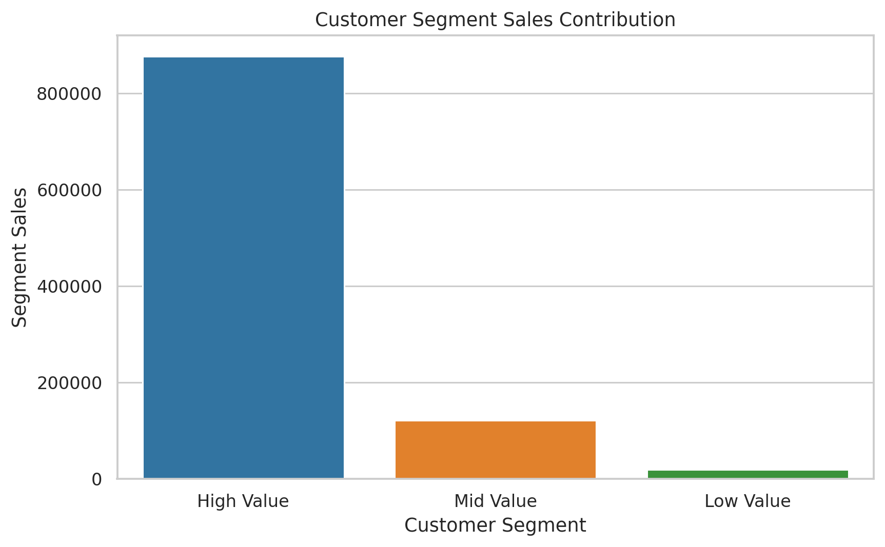
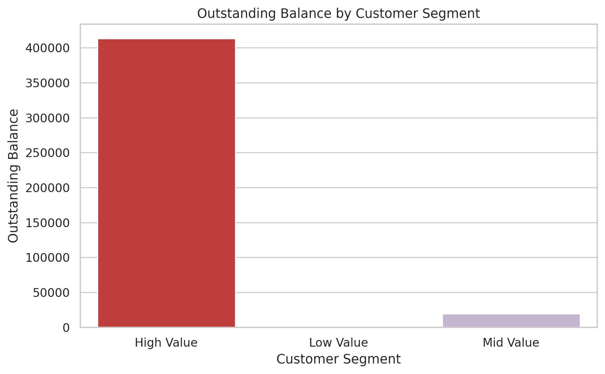
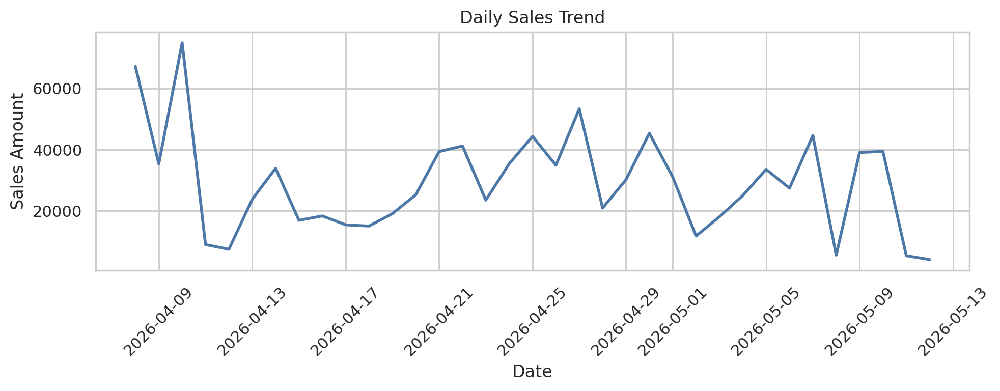
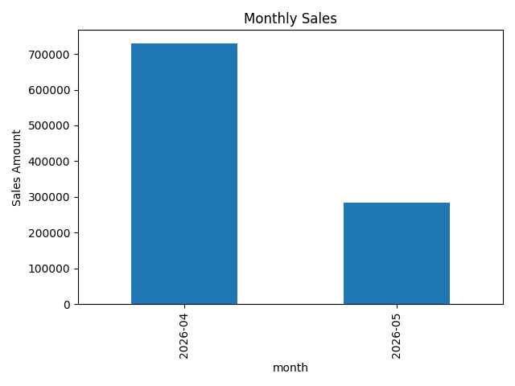
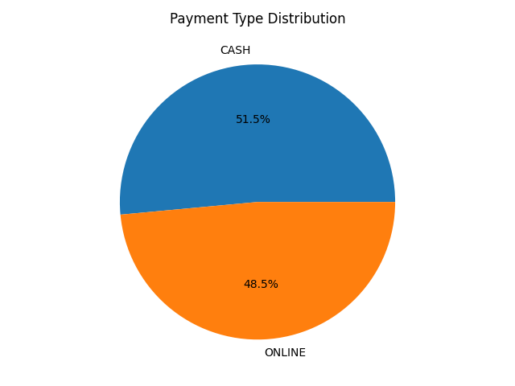
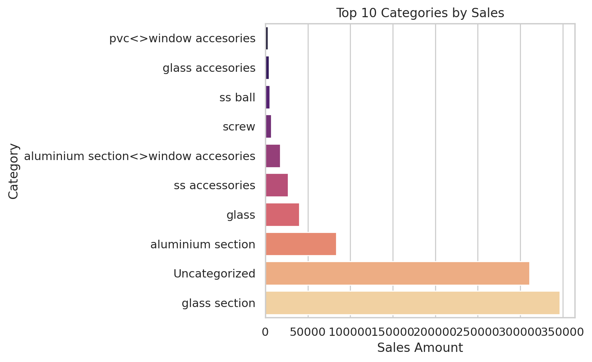
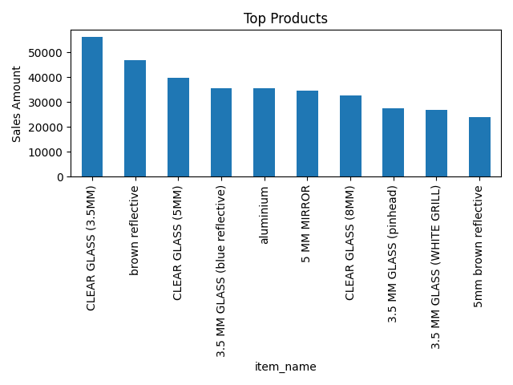
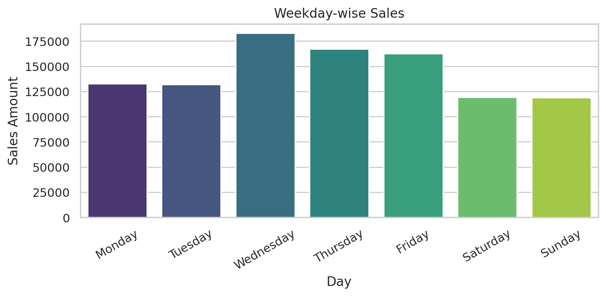
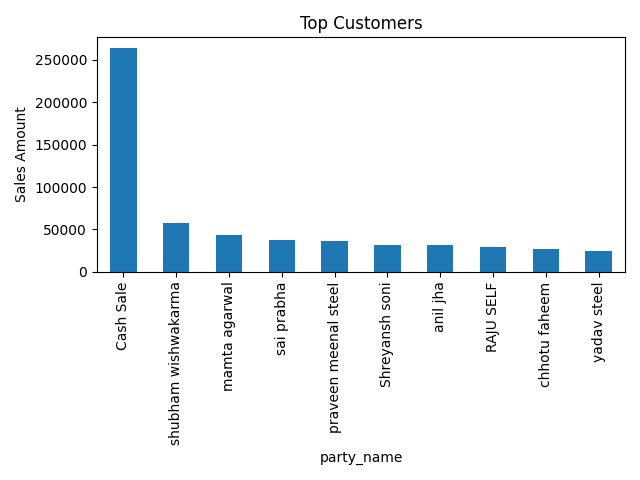

# Inventory-Optimization-Analytics-System-
# Sales & Customer Analytics Dashboard

## Project Overview

This project analyzes sales transactions from STAR ENTERPRISES (Steel, Aluminium, Glass & UPVC Products) to identify customer behavior, sales trends, product performance, payment patterns, and business growth opportunities.

The project uses Python, Pandas, Excel, and Data Visualization techniques to transform raw sales data into actionable business insights.

---

## Business Problem

The organization maintained sales records but lacked visibility into:

- Top-performing customers
- Revenue-driving products
- Customer segmentation
- Outstanding dues
- Payment method trends
- Daily and monthly sales performance

This project was developed to convert raw transactional data into meaningful business intelligence for decision-making.

---

## Objectives

- Analyze overall sales performance
- Identify top customers and products
- Segment customers based on sales contribution
- Track outstanding balances
- Understand payment behavior
- Monitor daily and monthly sales trends
- Discover high-revenue product categories

---

## Tools & Technologies

- Python
- Pandas
- Matplotlib
- Excel
- Data Cleaning
- ETL Process

---

## Dataset Information

Source: Internal Sales Data (STAR ENTERPRISES)

Period Covered:
- April 2026
- May 2026

Data Includes:
- Invoice Details
- Customer Information
- Product Information
- Payment Information
- Outstanding Dues

---

## ETL Process

### Extract
Sales and item data imported from Excel files.

### Transform
- Removed missing values
- Standardized columns
- Cleaned customer and product records
- Generated date-based attributes
- Created customer segmentation

### Load
Prepared datasets exported for analysis and reporting.

---

## Key Analysis Performed

### Customer Analysis
- Top Customers by Revenue
- Customer Segmentation
- Outstanding Balance Analysis

### Product Analysis
- Top Selling Products
- Category-wise Sales Performance

### Sales Analysis
- Daily Sales Trend
- Monthly Sales Trend
- Weekday-wise Sales Analysis

### Financial Analysis
- Outstanding Due Tracking
- Payment Type Distribution

---

## Key Insights

### Customer Segmentation

- High Value customers contribute the majority of revenue.
- A small group of customers generates most business sales.
- High-value customers also hold the highest outstanding balances.

### Product Performance

Top-performing products include:

- CLEAR GLASS (3.5MM)
- Brown Reflective Glass
- CLEAR GLASS (5MM)
- Aluminium Products
- Mirrors

### Category Performance

Highest revenue-generating categories:

1. Glass Section
2. Uncategorized Products
3. Aluminium Section

### Sales Trend

- Sales remained consistent throughout the analysis period.
- Peak sales were observed during weekdays.
- Wednesday recorded the highest sales volume.

### Payment Analysis

- Cash Payments: 51.5%
- Online Payments: 48.5%

Business shows strong adoption of digital payments while maintaining significant cash transactions.

---

## Visualizations

### Customer Segment Contribution


### Outstanding Balance Analysis


### Daily Sales Trend


### Monthly Sales


### Payment Type Distribution


### Category Analysis


### Product Analysis


### Weekday Sales


### Top Customers


---

## Project Structure

```text
├── sales data april to may 2026.xlsx
├── cleaned_sales_report.csv
├── etl_pipeline.py
├── monthly_sales.png
├── top_customers.png
├── top_products.png
├── payment_type.png
├── payment_share.png
├── customer_segment_sales.png
├── customer_segment_due.png
├── daily_sales_trend.png
├── top_categories.png
├── weekday_sales.png
└── README.md
```

---

## Business Impact

- Improved visibility into customer purchasing patterns.
- Enabled identification of high-value customers.
- Highlighted customers with significant outstanding dues.
- Identified top-performing products and categories.
- Supported data-driven inventory and sales decisions.

---

## Skills Demonstrated

- Data Cleaning
- Exploratory Data Analysis (EDA)
- Customer Segmentation
- Business Analytics
- Data Visualization
- ETL Pipeline Development
- Reporting & Dashboarding

---

## Author

Ritik Khare

B.Tech Computer Science & Engineering

Aspiring Data Analyst | SQL | Python | Excel | Power BI
